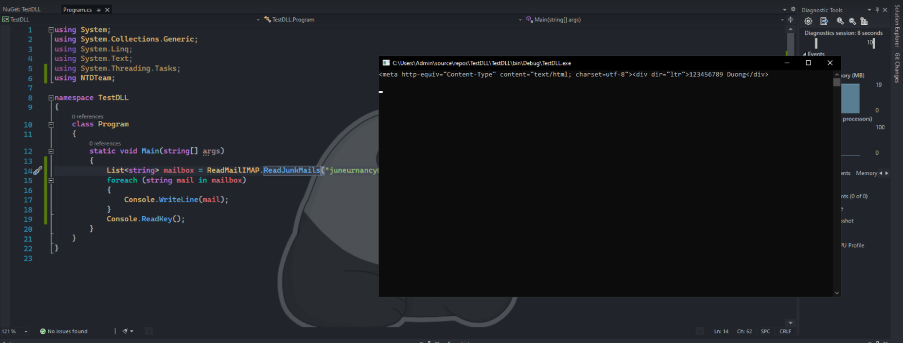
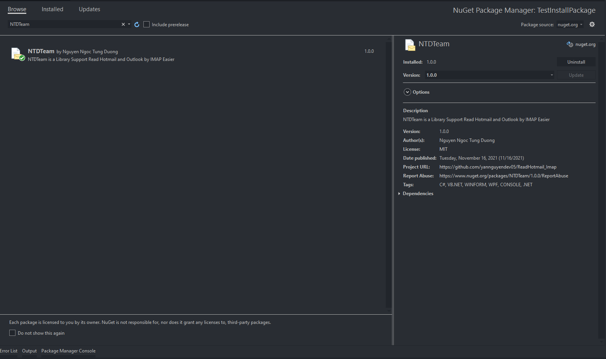

<div id="top"></div>

<!-- PROJECT LOGO -->
<br />
<div align="center">
  <a href="https://github.com/othneildrew/Best-README-Template">
    
  </a>

  <h3 align="center">Read Hotmail Using IMAP</h3>

  <p align="center">
    NTDTeam is a Library Support Read Hotmail and Outlook by IMAP Easier
    <br />
    <a href=""><strong>Explore the docs »</strong></a>
    <br />
    <br />
    <a href="https://yansoftware.vn/">Visit My Website</a>
    ·
    <a href="https://www.facebook.com/YanNguyenDev.Official">Contact Me</a>
    ·
    <a href="https://api.yansoftware.vn/">Free API</a>
  </p>
</div>


<!-- ABOUT THE PROJECT -->
## About The Project

<div align="center">
  <a href="https://www.facebook.com/YanNguyenDev.Official">
    
  </a>
  <p>NTDTeam is a Library Support Read Hotmail and Outlook by IMAP Easier. The library will read the mail and return the result as the content of the email in HTML form to convenient REGEX the data !!!</p>
</div>

<!-- GETTING STARTED -->
## Getting Started
  # Installation via [NuGet](https://www.nuget.org/)
   * METHOD 1: Using Package Manager Console
```
PM> Install-Package NTDTeam -Version 1.0.0
```
   * METHOD 1: Using Nuget Package Manager

<div align="center">
  <a href="https://www.facebook.com/YanNguyenDev.Official">
    
  </a>
</div>


<!-- USAGE EXAMPLES -->
## Usage

### Step 1: Library declaration
```csharp
using NTDTeam;
```
### Step 2: Declare variable
```csharp
 string email = "YanNguyenDevdemo@hotmail.com"; //Email Address That Turned ON IMAP
 string passemail = "PassDemo@2005"; //Password Of Email Above
 int timeout = 10; //Number Of Times To Check Mailboxes
 List<string> Mails = new List<string>; //Declare mailbox as list
```
### Step 2: Use one of the following functions
1. Read All Mails In Inbox:
```csharp
 Mails = ReadMailIMAP.ReadAllInboxMails(email, passemail, timeout);
```

2. Read All Unread Mails In Inbox:
```csharp
Mails = ReadMailIMAP.ReadAllUnreadMails(email, passemail, timeout);
```
3. Read All Mails In Junk (Spam):
```csharp
Mails = ReadMailIMAP.ReadJunkMails(email, passemail, timeout);
```
4. Read All Unread Mails In Junk (Spam):
```csharp
Mails = ReadMailIMAP.ReadUnreadJunkMails(email, passemail, timeout);
```
### Step 3: Export each email in the Mailbox
```csharp
foreach (string mail in Mails)
{
  Console.WriteLine(mail);
}
```

## Donate
- **Paypal**: mindun94203@gmail.com - Nguyen Ngoc Tung Duong
- **VietTinBank**: 106872826613 - Nguyen Ngoc Tung Duong
- **MBBank**: 0090420032005 - Nguyen Ngoc Tung Duong
- **MOMO**: 0917799104 - Nguyen Ngoc Tung Duong
## Contacts
- **Facebook**: [Nguyễn Ngọc Tùng Dương](https://www.facebook.com/YanNguyenDev.Official/)  
- **Instagram**: [Nguyễn Ngọc Tùng Dương](https://www.instagram.com/yannguyendev_05/)
- **Tiktok**: [Hôm ấy chúng ta rời bỏ nhau](https://www.tiktok.com/@yannguyendev_05)
- **Twitter**: [Nguyễn Ngọc Tùng Dương](https://twitter.com/YanNguyenDev_05)
- **Youtube**: [Yan Software](https://www.youtube.com/c/YanSoftware)
- **Github**: [yannguyendev05](https://github.com/yannguyendev05/)
- **Zalo**: [+84917799104](#)
- **E-Mail**: mindun94203@gmail.com

